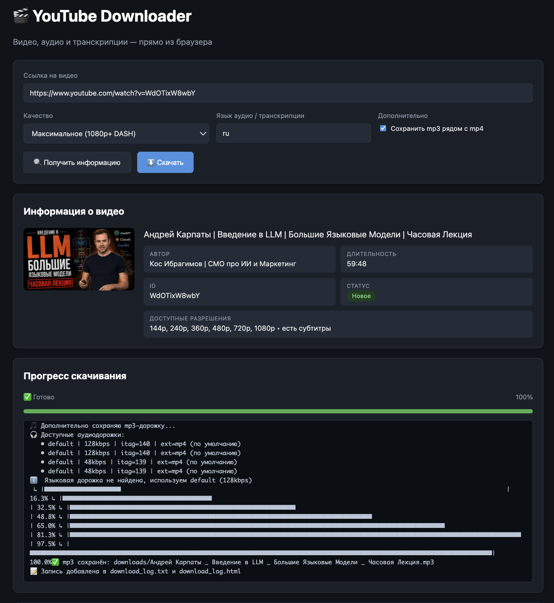

[English](README.md) | [Русский](README.RU.md) | [Українська](README.UK.md) | [Português](README.PT.md) | [Deutsch](README.DE.md) | Français

# 🎬 YouTube Downloader

Télécharge des **vidéos (mp4)**, de l'**audio (mp3)** et des **transcriptions textuelles** (à partir des sous-titres) depuis YouTube — au choix, ou tout à la fois. Deux interfaces :

- **CLI** — `download.py`, un outil en console écrit en Python ;
- **Interface Web** — `web_server.py` (Flask) + `web_ui.html` (JS dans le navigateur) : barre de progression, journal de téléchargement, liste des fichiers avec liens de téléchargement.



Langues de l'interface : **English, Русский, Українська, Português, Deutsch, Français**.

Licence : **MIT** — utilisation libre sans restriction (voir [LICENSE](LICENSE)).

## Fonctionnalités

- 🎥 Vidéo en qualité maximale (1080p / 1440p / 4K via flux DASH fusionnés avec ffmpeg), moyenne ou basse
- 🎧 Audio seul, converti en mp3 avec débit au choix (128/192/320 kbps) — idéal pour l'écoute en déplacement
- 📄 Transcription textuelle des sous-titres (nettoyée des codes temporels et des balises) enregistrée à côté du fichier média ou seule (mode `text`)
- 🌍 Choix de la langue de la piste audio et des sous-titres (`--lang ru`, `en`, …) ; la piste russe est prioritaire sur les vidéos multilingues
- 🔁 Protection contre les doublons par type de contenu : une vidéo téléchargée en basse qualité peut ensuite être récupérée en qualité maximale, en audio ou en texte (journal basé sur les ID ; les entrées dont le fichier a été supprimé sont retéléchargeables)
- ⏳ File d'attente : une vidéo indisponible (privée, supprimée, contrôle anti-bot) est mise en file automatiquement et téléchargée avec notification dès qu'elle redevient disponible
- 📝 Journal de téléchargement en deux formats : `download_log.txt` et `download_log.html`
- 🖥️ Interface Web : informations sur la vidéo avant téléchargement, progression en direct, historique, téléchargement des fichiers directement depuis le navigateur
- 🌐 Langue de l'interface modifiable en CLI comme dans l'interface Web (6 langues, détection automatique par défaut)

## Structure du dépôt

```
├── download.py            # Téléchargeur CLI (logique principale)
├── web_server.py          # Serveur Web (API Flask + sert l'interface)
├── web_ui.html            # Interface Web (HTML/JS)
├── i18n.py                # Moteur de langue de l'interface
├── locales/               # Traductions : en, ru, uk, pt, de, fr
├── requirements.txt       # Dépendances Python
├── Screeshot/             # Capture d'écran utilisée dans les README
├── .github/workflows/     # GitHub Actions : téléchargement sans installation locale
├── .devcontainer/         # Configuration GitHub Codespaces
└── legacy/                # Anciennes versions du script (historique de développement)
```

Les fichiers téléchargés vont dans `downloads/`, le journal se trouve à la racine du projet et la file d'attente dans `pending_queue.json`. Tous ces chemins (ainsi que les fichiers personnels) sont exclus de git via `.gitignore`.

## Installation (locale)

### 1. Prérequis

- **Python 3.10+** (testé sur 3.12)
- **ffmpeg** — nécessaire pour fusionner les flux DASH (qualité au-delà de 720p) et convertir en mp3. Sans lui, le programme fonctionne quand même, mais la vidéo est limitée à 720p (progressive) et l'audio reste dans son format d'origine (m4a)

### 2. Installation de ffmpeg

| OS | Commande |
|---|---|
| macOS | `brew install ffmpeg` |
| Ubuntu / Debian | `sudo apt install ffmpeg` |
| Windows | `winget install Gyan.FFmpeg` (ou `choco install ffmpeg`), puis redémarrer le terminal |

Vérification : `ffmpeg -version`

### 3. Clonage et dépendances

```bash
git clone https://github.com/YOUR_LOGIN/YOUR_REPOSITORY.git
cd YOUR_REPOSITORY

python3 -m venv .venv
source .venv/bin/activate        # Windows : .venv\Scripts\activate
pip install -r requirements.txt
```

## Utilisation : CLI

### Mode interactif

```bash
python download.py
```

Pose les questions étape par étape : URL → qualité → langue → faut-il enregistrer le mp3.

### Avec arguments

```bash
python download.py "https://youtu.be/XXXX" max          # vidéo de meilleure qualité + transcription
python download.py "https://youtu.be/XXXX" audio        # mp3 seul + transcription
python download.py "https://youtu.be/XXXX" text         # texte seul (transcription)
python download.py "https://youtu.be/XXXX" audio --abitrate 320k
python download.py "https://youtu.be/XXXX" medium --lang en
python download.py "https://youtu.be/XXXX" max --mp3 -o video   # + mp3, dossier video/
python download.py "https://youtu.be/XXXX" max --ui-lang de     # interface en allemand
```

| Argument | Signification |
|---|---|
| `url` | URL de la vidéo (sans elle — mode interactif) |
| `quality` | `max` / `medium` / `low` / `audio` / `text` |
| `--abitrate` | débit mp3 pour `audio` et `--mp3` : `128k`/`192k`/`320k` (par défaut 192k) |
| `--lang`, `-l` | langue de l'audio et de la transcription (par défaut : `ru`) |
| `--mp3` | enregistrer en plus une piste mp3 à côté du mp4 |
| `-o`, `--output` | dossier de sortie (par défaut : `downloads`) |
| `--ui-lang`, `-u` | langue de l'interface : `en`/`ru`/`uk`/`pt`/`de`/`fr` |

La langue de l'interface est détectée automatiquement depuis les paramètres régionaux du système (`LANG`/`LC_ALL`) ; utilisez `--ui-lang` pour forcer le choix, ou définissez la variable d'environnement `YTD_LANG`.

Commandes de la file d'attente :

```bash
python download.py --check-queue     # vérifier la file et télécharger ce qui est devenu disponible
python download.py --watch 30        # surveiller la file, vérification toutes les 30 minutes (Ctrl+C pour quitter)
python download.py --queue-list      # afficher la file
python download.py --queue-remove URL
```

Une vidéo momentanément indisponible (privée, supprimée, contrôle anti-bot) est ajoutée à la file automatiquement ; de plus, la file est vérifiée automatiquement à chaque exécution.

Aide complète : `python download.py --help`

Résultat dans `downloads/` :

```
Titre de la vidéo.mp4            # vidéo (ou .mp3 en mode audio)
Titre de la vidéo.mp3            # avec --mp3 ou quality=audio
Titre de la vidéo [320k].mp3     # audio avec un débit non standard
Titre de la vidéo.transcript.txt # transcription des sous-titres
```

## Utilisation : interface Web

```bash
python web_server.py
```

Ouvrez **http://127.0.0.1:8080** dans votre navigateur :

1. Collez un lien → **« Obtenir les infos »** : miniature, auteur, durée, résolutions disponibles, présence de sous-titres, statut (« nouveau », ou exactement ce qui est déjà téléchargé : vidéo 1080p, mp3, transcription)
2. Choisissez la qualité, la langue et le débit mp3 → **« Télécharger »** : barre de progression en direct et journal console
3. En dessous — la liste des fichiers prêts (téléchargez-les directement depuis le navigateur), le journal complet des téléchargements et la carte de la file d'attente avec le bouton « Vérifier maintenant »

La langue de l'interface se choisit avec le sélecteur 🌐 en haut à droite ; le choix est mémorisé dans le navigateur. Le journal de téléchargement et la sortie console suivent eux aussi la langue sélectionnée.

L'hôte et le port peuvent être modifiés via des variables d'environnement :

```bash
HOST=0.0.0.0 PORT=8080 python web_server.py
```

## Exécution directement sur GitHub

Un site statique (GitHub Pages) ne fonctionnera pas ici — un backend Python est indispensable. Deux options fonctionnelles à la place.

### Option 1 : GitHub Actions (sans installation locale)

Le dépôt contient un workflow à déclenchement manuel `.github/workflows/download.yml` :

1. Ouvrez l'onglet **Actions** → **Download YouTube video** → **Run workflow**
2. Renseignez l'URL, la qualité (`max`/`medium`/`low`/`audio`/`text`), le débit mp3, la langue du contenu, la langue de l'interface et la nécessité du mp3
3. Attendez la fin → le résumé de l'exécution affiche l'**artefact `youtube-download`** — téléchargez le zip avec vos fichiers

Rien n'est stocké dans le dépôt : l'exécution livre uniquement le fichier média lui-même (mp4/mp3) sous forme d'artefact éphémère (1 jour). Téléchargez le zip depuis le résumé de l'exécution ; pour les transcriptions et les journaux, exécutez l'outil localement.

⚠️ **Limites** : les artefacts sont conservés une durée limitée (1 jour ici), la taille est plafonnée, et YouTube bloque souvent les IP de datacenters (l'erreur « Sign in to confirm you're not a bot »). Pour un usage régulier, exécutez localement.

### Option 2 : GitHub Codespaces (interface Web complète dans le cloud)

1. Bouton **Code** → onglet **Codespaces** → **Create codespace on master**
2. Le conteneur est configuré via `.devcontainer/devcontainer.json` : Python 3.12, ffmpeg, dépendances — installés automatiquement
3. Dans le terminal : `python web_server.py` — le port 8080 est transféré automatiquement et le navigateur s'ouvre tout seul

Pour info : le quota gratuit de Codespaces pour les comptes GitHub personnels est de 120 heures-cœur par mois — largement suffisant pour un usage occasionnel.

## Journal de téléchargement

Chaque téléchargement ajoute une entrée :

- `download_log.txt` — journal lisible par machine (utilisé pour détecter les « déjà téléchargées ») ;
- `download_log.html` — un tableau lisible avec des liens.

Les doublons sont suivis par type et qualité : une même vidéo peut être téléchargée en plusieurs résolutions, plusieurs débits mp3 et en texte. Pour retélécharger le même élément, supprimez sa ligne de `download_log.txt` — ou supprimez simplement le fichier de `downloads/` : les entrées sans fichier sur le disque sont retéléchargeables.

## Dépannage

| Problème | Solution |
|---|---|
| La vidéo se télécharge en 720p maximum | ffmpeg introuvable → fusion DASH indisponible. Installez ffmpeg et vérifiez `ffmpeg -version` |
| « Sign in to confirm you're not a bot » | YouTube bloque votre IP (souvent avec les VPN/datacenters). Essayez un autre réseau ou exécutez localement |
| Pas de mp3, un `.m4a` subsiste | ffmpeg n'est pas installé — conversion impossible, le flux audio d'origine a été conservé |
| Pas de transcription | La vidéo n'a pas de sous-titres. Les sous-titres auto-générés par YouTube sont également pris en charge quand ils existent |
| « Access denied » (403) ou « Address already in use » sur le port 5000 | AirPlay (Centre de contrôle) de macOS intercepte le port 5000 ; le serveur web écoute donc par défaut sur 8080. Si vous avez besoin du 5000, désactivez le récepteur AirPlay (Réglages Système → Général → AirDrop et Handoff) ou définissez un autre `PORT` |
| pytubefix cesse de fonctionner après une mise à jour de YouTube | `pip install -U pytubefix` — la bibliothèque est corrigée activement au fil des changements de YouTube |
| Vidéo indisponible (privée/supprimée) | Elle est placée automatiquement dans la file d'attente — lancez avec `--check-queue` ou `--watch` (ou cliquez sur « Vérifier maintenant » dans l'interface Web) et elle sera téléchargée dès qu'elle redevient disponible |

## Licence

[MIT](LICENSE) — utilisation, copie, modification et distribution libres, y compris à des fins commerciales.

⚠️ **Note juridique** : ce programme est destiné au téléchargement de contenu dont vous détenez les droits (votre propre contenu, contenu sous licence ouverte, ou téléchargement autorisé dans votre juridiction). Respectez les conditions d'utilisation de YouTube et le droit d'auteur.
