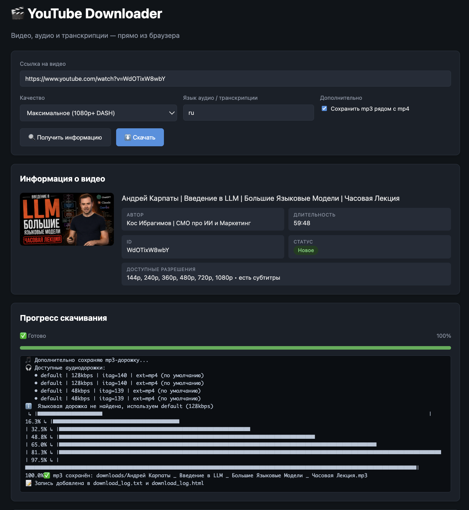

[English](README.md) | [Русский](README.RU.md) | Українська | [Português](README.PT.md) | [Deutsch](README.DE.md) | [Français](README.FR.md)

# 🎬 YouTube Downloader

Завантажує **відео (mp4)**, **аудіо (mp3)** та **текстові транскрипти** (з субтитрів) з YouTube — будь-що з них або все одразу. Два інтерфейси:

- **CLI** — `download.py`, консольний інструмент на Python;
- **Web UI** — `web_server.py` (Flask) + `web_ui.html` (JS у браузері): індикатор прогресу, журнал завантажень, список файлів із посиланнями для завантаження.



Мови інтерфейсу: **English, Русский, Українська, Português, Deutsch, Français**.

Ліцензія: **MIT** — безкоштовне використання без обмежень (див. [LICENSE](LICENSE)).

## Можливості

- 🎥 Відео максимальної якості (1080p / 1440p / 4K через DASH-потоки, злиті за допомогою ffmpeg), середньої або низької
- 🎧 Лише аудіо, конвертоване в mp3 (192 kbps) — зручно для прослуховування на вулиці
- 📄 Текстовий транскрипт із субтитрів (очищений від таймкодів і розмітки), збережений поруч із медіафайлом
- 🌍 Вибір мови аудіодоріжки та субтитрів (`--lang ru`, `en`, …); на багатомовних відео пріоритет має російська доріжка
- 🔁 Захист від дублювання: вже завантажені відео пропускаються (ведеться журнал на основі ID)
- 📝 Журнал завантажень у двох форматах: `download_log.txt` і `download_log.html`
- 🖥️ Вебінтерфейс: інформація про відео перед завантаженням, прогрес у реальному часі, історія, завантаження файлів просто з браузера
- 🌐 Перемикання мови інтерфейсу і в CLI, і у Web UI (6 мов, за замовчуванням — автовизначення)

## Структура репозиторію

```
├── download.py            # Консольний завантажувач (основна логіка)
├── web_server.py          # Вебсервер (Flask API + роздає UI)
├── web_ui.html            # Вебінтерфейс (HTML/JS)
├── i18n.py                # Механізм мов інтерфейсу
├── locales/               # Переклади: en, ru, uk, pt, de, fr
├── requirements.txt       # Залежності Python
├── Screeshot/             # Скріншот для README
├── .github/workflows/     # GitHub Actions: завантаження без локальної установки
├── .devcontainer/         # Налаштування GitHub Codespaces
└── legacy/                # Старі версії скриптів (історія розробки)
```

Завантажені файли потрапляють у `downloads/`, журнал зберігається в корені проєкту. Обидва шляхи (і особисті файли) виключені з git через `.gitignore`.

## Встановлення (локально)

### 1. Вимоги

- **Python 3.10+** (перевірено на 3.12)
- **ffmpeg** — потрібен для злиття DASH-потоків (якість вище 720p) і конвертації в mp3. Без нього програма працює, але відео обмежене 720p (progressive), а аудіо залишається у початковому форматі (m4a)

### 2. Встановлення ffmpeg

| ОС | Команда |
|---|---|
| macOS | `brew install ffmpeg` |
| Ubuntu / Debian | `sudo apt install ffmpeg` |
| Windows | `winget install Gyan.FFmpeg` (або `choco install ffmpeg`), потім перезапустіть термінал |

Перевірка: `ffmpeg -version`

### 3. Клонування та залежності

```bash
git clone https://github.com/YOUR_LOGIN/YOUR_REPOSITORY.git
cd YOUR_REPOSITORY

python3 -m venv .venv
source .venv/bin/activate        # Windows: .venv\Scripts\activate
pip install -r requirements.txt
```

## Використання: CLI

### Інтерактивний режим

```bash
python download.py
```

Запитує крок за кроком: URL → якість → мова → чи зберігати mp3.

### З аргументами

```bash
python download.py "https://youtu.be/XXXX" max          # відео найкращої якості + транскрипт
python download.py "https://youtu.be/XXXX" audio        # лише mp3 + транскрипт
python download.py "https://youtu.be/XXXX" medium --lang en
python download.py "https://youtu.be/XXXX" max --mp3 -o video   # + mp3, тека video/
python download.py "https://youtu.be/XXXX" max --ui-lang de     # німецький інтерфейс
```

| Аргумент | Значення |
|---|---|
| `url` | URL відео (без нього — інтерактивний режим) |
| `quality` | `max` / `medium` / `low` / `audio` |
| `--lang`, `-l` | мова аудіо та транскрипту (за замовчуванням: `ru`) |
| `--mp3` | додатково зберегти mp3-доріжку поруч із mp4 |
| `-o`, `--output` | тека для збереження (за замовчуванням: `downloads`) |
| `--ui-lang`, `-u` | мова інтерфейсу: `en`/`ru`/`uk`/`pt`/`de`/`fr` |

Мова інтерфейсу визначається автоматично за системною локаллю (`LANG`/`LC_ALL`); використайте `--ui-lang`, щоб перевизначити, або задайте змінну середовища `YTD_LANG`.

Повна довідка: `python download.py --help`

Результат у `downloads/`:

```
Video title.mp4                  # відео (або .mp3 в режимі audio)
Video title.mp3                  # з --mp3 або quality=audio
Video title.transcript.txt       # транскрипт із субтитрів
```

## Використання: Web UI

```bash
python web_server.py
```

Відкрийте **http://127.0.0.1:5000** у браузері:

1. Вставте посилання → **«Отримати інформацію»**: мініатюра, автор, тривалість, доступні роздільності, наявність субтитрів, статус («нове» / «вже завантажено»)
2. Оберіть якість і мову → **«Завантажити»**: прогрес-бар і консольний журнал у реальному часі
3. Нижче — список готових файлів (завантаження просто з браузера) та повний журнал завантажень

Мову інтерфейсу обирається через перемикач 🌐 у правому верхньому куті; вибір зберігається у браузері. Журнал завантажень/консольний вивід також слідує обраній мові.

Хост і порт можна змінити змінними середовища:

```bash
HOST=0.0.0.0 PORT=8080 python web_server.py
```

## Запуск напряму на GitHub

Статичний сайт (GitHub Pages) тут не підійде — потрібен бекенд на Python. Натомість є два робочі варіанти.

### Варіант 1: GitHub Actions (без локальної установки)

У репозиторії є воркфлоу з ручним запуском `.github/workflows/download.yml`:

1. Відкрийте вкладку **Actions** → **Download YouTube video** → **Run workflow**
2. Вкажіть URL, якість (`max`/`medium`/`low`/`audio`), мову контенту, мову інтерфейсу та чи потрібен mp3
3. Дочекайтеся завершення → у підсумку запуску буде **артефакт `youtube-download`** — завантажте zip із вашими файлами

⚠️ **Обмеження**: артефакти зберігаються обмежений час (тут — 1 доба), розмір обмежений, а YouTube часто блокує IP дата-центрів (помилка «Sign in to confirm you're not a bot»). Для регулярного користування запускайте локально.

### Варіант 2: GitHub Codespaces (повний вебінтерфейс у хмарі)

1. Кнопка **Code** → вкладка **Codespaces** → **Create codespace on master**
2. Контейнер налаштований через `.devcontainer/devcontainer.json`: Python 3.12, ffmpeg, залежності — встановлюються автоматично
3. У терміналі: `python web_server.py` — порт 5000 пробрасується автоматично, браузер відкриється сам

Довідково: безкоштовна квота Codespaces для особистих акаунтів GitHub — 120 ядро-годин на місяць — вистачає для епізодичного використання.

## Журнал завантажень

Кожне завантаження додає запис:

- `download_log.txt` — машинозчитуваний журнал (використовується для визначення «вже завантажено»);
- `download_log.html` — зручна для людини таблиця з посиланнями.

Щоб завантажити відео повторно, видаліть його ID з `download_log.txt` (та файл із `downloads/`).

## Усунення проблем

| Проблема | Рішення |
|---|---|
| Відео завантажується максимум у 720p | ffmpeg не знайдено → злиття DASH недоступне. Встановіть ffmpeg і перевірте `ffmpeg -version` |
| «Sign in to confirm you're not a bot» | YouTube блокує ваш IP (часто з VPN/дата-центрів). Спробуйте іншу мережу або запуск локально |
| Немає mp3, залишається `.m4a` | ffmpeg не встановлено — конвертація неможлива, збережено початковий аудіопотік |
| Немає транскрипту | Відео без субтитрів. Автоматичні субтитри YouTube також підтримуються, якщо доступні |
| «Address already in use» під час запуску Web UI | На macOS порт 5000 часто зайнятий AirPlay (Control Center) — запустіть на іншому порту: `PORT=8080 python web_server.py` |
| pytubefix ламається після оновлення YouTube | `pip install -U pytubefix` — бібліотеку активно лагодять у міру змін YouTube |

## Ліцензія

[MIT](LICENSE) — вільне використання, копіювання, модифікація та поширення, включно з комерційним.

⚠️ **Правова примітка**: програма призначена для завантаження контенту, на який ви маєте права (власний контент, контент з відкритою ліцензією або завантаження, дозволене у вашій юрисдикції). Поважайте Умови користування YouTube та авторські права.
