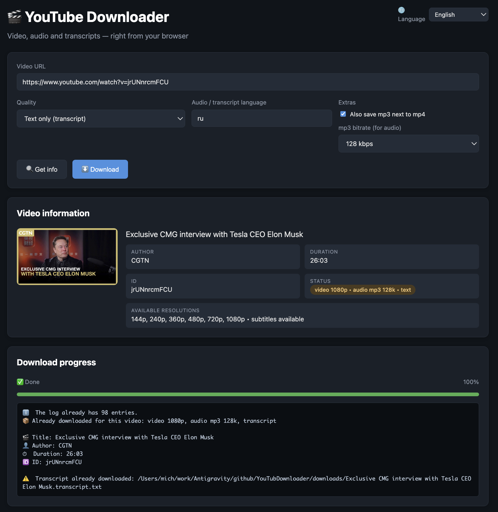

English | [Русский](README.RU.md) | [Українська](README.UK.md) | [Português](README.PT.md) | [Deutsch](README.DE.md) | [Français](README.FR.md)

# 🎬 YouTube Downloader

Downloads **video (mp4)**, **audio (mp3)** and **text transcripts** (from subtitles) from YouTube — any of them, or all at once. Two interfaces:

- **CLI** — `download.py`, a console tool written in Python;
- **Web UI** — `web_server.py` (Flask) + `web_ui.html` (JS in the browser): progress bar, download log, file list with download links.



Interface languages: **English, Русский, Українська, Português, Deutsch, Français**.

License: **MIT** — free to use without restrictions (see [LICENSE](LICENSE)).

## Quick start

```bash
git clone https://github.com/YOUR_LOGIN/YOUR_REPOSITORY.git
cd YOUR_REPOSITORY

python3 -m venv .venv
source .venv/bin/activate        # Windows: .venv\Scripts\activate
pip install -r requirements.txt

# option 1 — console: best-quality video + transcript
python download.py "https://youtu.be/XXXX" max

# option 2 — web interface: http://127.0.0.1:8080
python web_server.py
```

**ffmpeg** is needed for 1080p+ and mp3 conversion (see the Installation section below). Everything you download and every working file (`downloads/`, logs, the waiting queue) stays on your machine — none of it ever gets into the repository (see Settings).

## Features

- 🎥 Video at maximum quality (1080p / 1440p / 4K via DASH streams merged with ffmpeg), medium or low
- 🎧 Audio only, converted to mp3 at a chosen bitrate (128/192/320 kbps) — great for listening on the go
- 📄 Text transcript from subtitles (cleaned of timecodes and markup) saved next to the media file or on its own (`quality=text`)
- 🌍 Audio track and subtitle language selection (`--lang ru`, `en`, …); Russian track gets priority on multi-language videos
- 🔁 Duplicate protection per content type: a video downloaded in low quality can still be fetched in max quality, as audio or as text (an ID-based log is kept; entries whose file was deleted are re-downloadable)
- ⏳ Waiting queue: an unavailable video (private, removed, bot-check) is queued automatically and downloaded with a notification once it becomes available
- 📝 Download log in two formats: `download_log.txt` and `download_log.html`
- 🖥️ Web UI: video info before downloading, live progress, history, file downloads straight from the browser
- 🌐 Interface language switchable in both CLI and Web UI (6 languages, auto-detected by default)

See [CHANGELOG.md](CHANGELOG.md) for what's new in this version.

## Repository structure

```
├── download.py            # CLI downloader (core logic)
├── web_server.py          # Web server (Flask API + serves the UI)
├── web_ui.html            # Web interface (HTML/JS)
├── i18n.py                # Interface language engine
├── locales/               # Translations: en, ru, uk, pt, de, fr
├── requirements.txt       # Python dependencies
├── CHANGELOG.md           # What's new in each version
├── Screeshot/             # Screenshot used in the READMEs
├── .github/workflows/     # GitHub Actions: download without a local install
├── .devcontainer/         # GitHub Codespaces setup
└── legacy/                # Old script versions (development history)
```

Downloaded files go to `downloads/`, the log lives in the project root and the waiting queue in `pending_queue.json`. All of these (and personal files) are excluded from git via `.gitignore`.

## Installation (local)

### 1. Requirements

- **Python 3.10+** (tested on 3.12)
- **ffmpeg** — required for merging DASH streams (quality above 720p) and mp3 conversion. Without it the program still works, but video is limited to 720p (progressive) and audio stays in its original format (m4a)

### 2. Installing ffmpeg

| OS | Command |
|---|---|
| macOS | `brew install ffmpeg` |
| Ubuntu / Debian | `sudo apt install ffmpeg` |
| Windows | `winget install Gyan.FFmpeg` (or `choco install ffmpeg`), then restart the terminal |

Verify: `ffmpeg -version`

### 3. Cloning and dependencies

```bash
git clone https://github.com/YOUR_LOGIN/YOUR_REPOSITORY.git
cd YOUR_REPOSITORY

python3 -m venv .venv
source .venv/bin/activate        # Windows: .venv\Scripts\activate
pip install -r requirements.txt
```

## Usage: CLI

### Interactive mode

```bash
python download.py
```

Asks step by step: URL → quality → language → whether to save mp3.

### With arguments

```bash
python download.py "https://youtu.be/XXXX" max          # best-quality video + transcript
python download.py "https://youtu.be/XXXX" audio        # mp3 only + transcript
python download.py "https://youtu.be/XXXX" text         # transcript only
python download.py "https://youtu.be/XXXX" audio --abitrate 320k
python download.py "https://youtu.be/XXXX" medium --lang en
python download.py "https://youtu.be/XXXX" max --mp3 -o video   # + mp3, folder video/
python download.py "https://youtu.be/XXXX" max --ui-lang de     # German interface
```

| Argument | Meaning |
|---|---|
| `url` | video URL (without it — interactive mode) |
| `quality` | `max` / `medium` / `low` / `audio` / `text` |
| `--abitrate` | mp3 bitrate for `audio` and `--mp3`: `128k`/`192k`/`320k` (default 192k) |
| `--lang`, `-l` | audio and transcript language (default: `ru`) |
| `--mp3` | additionally save an mp3 track next to the mp4 |
| `-o`, `--output` | output folder (default: `downloads`) |
| `--ui-lang`, `-u` | interface language: `en`/`ru`/`uk`/`pt`/`de`/`fr` |

The interface language is auto-detected from your system locale (`LANG`/`LC_ALL`); use `--ui-lang` to override, or set the `YTD_LANG` environment variable.

Waiting queue commands:

```bash
python download.py --check-queue     # check the queue and download whatever became available
python download.py --watch 30        # keep watching the queue, checking every 30 minutes (Ctrl+C to stop)
python download.py --queue-list      # show the queue
python download.py --queue-remove URL
```

A video that is currently unavailable (private, removed, bot-check) is added to the queue automatically; the queue is also checked automatically on every run.

Full help: `python download.py --help`

Result in `downloads/`:

```
Video title.mp4                  # video (or .mp3 in audio mode)
Video title.mp3                  # with --mp3 or quality=audio
Video title [320k].mp3           # audio at a non-default bitrate
Video title.transcript.txt       # transcript from subtitles
Video title [1080p].mp4         # the same video at another quality — old files are never touched
```

## Usage: Web UI

```bash
python web_server.py
```

Open **http://127.0.0.1:8080** in your browser:

1. Paste a link → **“Get info”**: thumbnail, author, duration, available resolutions, subtitle availability, status (“new”, or exactly what is already downloaded: video 1080p, mp3, transcript)
2. Pick quality, language and mp3 bitrate → **“Download”**: live progress bar and console log
3. Below — the list of ready files (download right from the browser), the full download log and the waiting-queue card with a “Check now” button

The interface language is chosen with the 🌐 selector in the top-right corner; the choice is remembered in the browser. The download log/console output follows the selected language too.

Host and port can be changed with environment variables:

```bash
HOST=0.0.0.0 PORT=8080 python web_server.py
```

## Settings

Environment variables:

| Variable | Meaning |
|---|---|
| `HOST`, `PORT` | Web UI address (default `127.0.0.1:8080`) |
| `YTD_LANG` | interface language: `en`/`ru`/`uk`/`pt`/`de`/`fr` (overrides auto-detection) |

All CLI options: `python download.py --help` — quality (`max`/`medium`/`low`/`audio`/`text`), mp3 bitrate, audio/transcript language, output folder, interface language, waiting-queue commands.

Files created during operation — all excluded from git via `.gitignore`, they never leave your machine:

| File / folder | Purpose |
|---|---|
| `downloads/` | downloaded media and transcripts (change with `-o`/`--output`) |
| `download_log.txt`, `download_log.html` | download journal: duplicate protection + human-readable table |
| `pending_queue.json` | waiting queue of unavailable videos |
| `_tmp_*` | temporary stream files, removed after merging/conversion |

## Running directly on GitHub

A static site (GitHub Pages) won't work here — a Python backend is required. Two working options instead.

### Option 1: GitHub Actions (no local install needed)

The repository includes a manually triggered workflow `.github/workflows/download.yml`:

1. Open the **Actions** tab → **Download YouTube video** → **Run workflow**
2. Provide the URL, quality (`max`/`medium`/`low`/`audio`/`text`), mp3 bitrate, content language, interface language, and whether mp3 is needed
3. Wait for completion → the run summary shows **artifact `youtube-download`** — download the zip with your files

Nothing is stored in the repository: the run delivers only the media file itself (mp4/mp3) as a short-lived artifact (1 day). Download the zip from the run summary; for transcripts and logs, run the tool locally.

⚠️ **Limitations**: artifacts are stored for a limited time (1 day here), size is capped, and YouTube often blocks datacenter IPs (the “Sign in to confirm you're not a bot” error). For regular use, run locally.

### Option 2: GitHub Codespaces (full web UI in the cloud)

1. **Code** button → **Codespaces** tab → **Create codespace on master**
2. The container is configured via `.devcontainer/devcontainer.json`: Python 3.12, ffmpeg, dependencies — installed automatically
3. In the terminal: `python web_server.py` — port 8080 is forwarded automatically and the browser opens by itself

For reference: the free Codespaces quota for personal GitHub accounts is 120 core-hours per month — enough for occasional use.

## Download log

Every download appends an entry:

- `download_log.txt` — machine-readable log (used to detect “already downloaded”);
- `download_log.html` — a human-friendly table with links.

Duplicates are tracked per type and quality: the same video can be downloaded at several resolutions, several mp3 bitrates and as text. To re-download the exact same item, remove its line from `download_log.txt` — or simply delete the file from `downloads/`: entries whose file no longer exists are re-downloadable.

Existing files are never deleted or overwritten: the same video at another quality or bitrate is saved as a new file next to the old one (`Video title [1080p].mp4`, `Video title [320k].mp3`). To replace a file, delete it from `downloads/` yourself.

The journal is append-only: entries are never removed — the full download history stays in both files even after the media files themselves have been deleted from `downloads/`. Parallel web-UI downloads are serialized with a lock, so no entry can be lost or corrupted.

## Troubleshooting

| Problem | Solution |
|---|---|
| Video downloads at 720p max | ffmpeg not found → DASH merging unavailable. Install ffmpeg and check `ffmpeg -version` |
| “Sign in to confirm you're not a bot” | YouTube blocks your IP (often on VPNs/datacenters). Try another network or run locally |
| No mp3, a `.m4a` remains | ffmpeg is not installed — conversion impossible, the original audio stream was kept |
| No transcript | The video has no subtitles. YouTube auto-generated captions are also supported when available |
| “Access denied” (403) or “Address already in use” on port 5000 | macOS AirPlay (Control Center) intercepts port 5000, so the web server defaults to 8080. If you need 5000 specifically, disable AirPlay Receiver (System Settings → General → AirDrop & Handoff) or set another `PORT` |
| pytubefix breaks after a YouTube update | `pip install -U pytubefix` — the library is actively patched as YouTube changes |
| Video unavailable (private/removed) | It is placed in the waiting queue automatically — run with `--check-queue` or `--watch` (or press “Check now” in the Web UI) and it downloads once it becomes available |

## License

[MIT](LICENSE) — free use, copying, modification and distribution, including commercial use.

⚠️ **Legal note**: this program is intended for downloading content you have the rights to (your own content, openly licensed content, or downloading permitted in your jurisdiction). Respect YouTube's Terms of Service and copyright.
